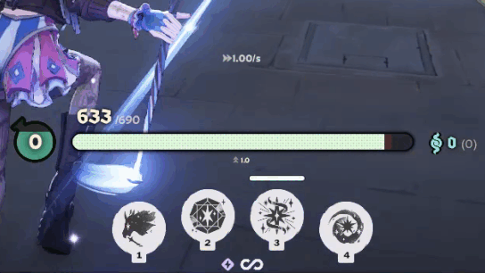
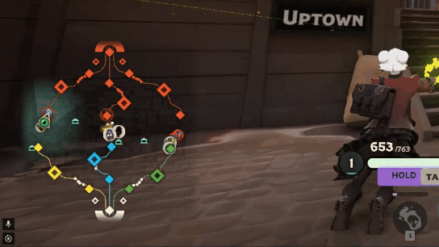
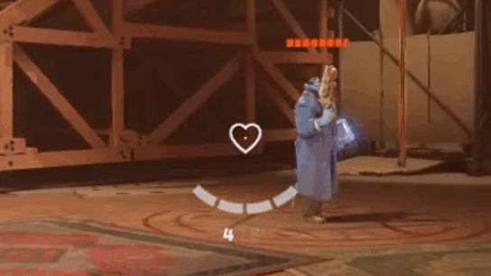
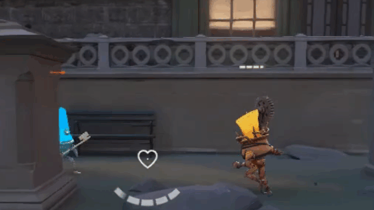
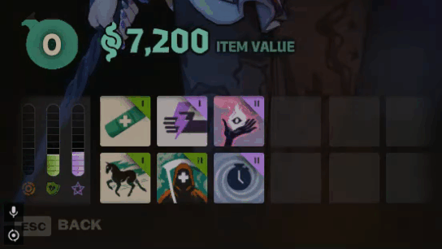

# mntbliss QoL HUD

A file-based Deadlock HUD addon. No injection. You edit CSS / `config.json`, this repo compiles them into Valve Panorama (`.vcss_c`, `.vxml_c`) and packs `game/citadel/addons/pak01_dir.vpk`.

**Install:** clone this repo next to Deadlock’s `game/` folder (tip below), then double-click [`install_compiled.bat`](install_compiled.bat). That uses the prebuilt pack in [`compiled/`](compiled/). No Bun, no CSDK.

**Rebuild / edit `config.json`:** install [Bun](https://bun.sh) and Reduced CSDK 12, then [`enable_mod.bat`](enable_mod.bat). If Deadlock or the CSDK is not found, set the paths in [`paths.json`](paths.json).

> [!TIP]
> Clone into your Deadlock install (`steamapps/common/Deadlock`, next to `game/`) so the script finds the game automatically:
>
> ```bat
> cd steamapps\common\Deadlock
> git clone <this-repo-url> mntbliss_QoL_mod
> ```
>
> Steam → Deadlock → gear → Manage → Browse local files opens that folder.

---

## What it does?

Toggles live in [`config.json`](config.json). Turn a feature off there if you only want part of the pack.

| | Feature | Preview |
| --- | --- | --- |
| HP | Bottom-center capsule, numbers above the bar, dotted fill, shields overlaid on top |  |
| Souls / level | Souls glued to the right-middle of the HP bar. Vanilla XP jar on the left. Shop restores the left gold cluster |  |
| Minimap | Rounded square, faded edges, dotted glass back |  |
| Dota Corners | `swap_minimap_inventory`: minimap left, items right (Dota home). Shop (`B`) still uses vanilla left |  |
| Crosshair | Heart outline. Pulses on low HP, cracks while reloading |  |
| Minions | Chunky top-center bars for troopers. Heroes keep vanilla dotted pips |  |
| Inventory | Idle dotted slots, sliders hidden. Shop (`B`) puts vanilla layout back |  |


> Fully close Deadlock after every rebuild. A reconnect is not enough.

---

## What the script touches

[`main.ts`](main.ts) is the only entry point. It calls the small modules under [`build/`](build/). Custom types live in [`types/`](types/) (one class per file).

- [Getting your settings](#getting-your-settings)
- [Finding Deadlock and the CSDK](#finding-deadlock-and-the-csdk)
- [Patching vanilla CSS in place](#patching-vanilla-css-in-place)
- [Patching XML layouts](#patching-xml-layouts)
- [Clearing trooper particle bars](#clearing-trooper-particle-bars)
- [Compiling originals into Valve file extensions](#compiling-originals-into-valve-file-extensions)
- [Packing the addon VPK](#packing-the-addon-vpk)
- [Turning the mod on in the game](#turning-the-mod-on-in-the-game)

### Getting your settings

| You edit | What it is |
| --- | --- |
| [`config.json`](config.json) | Colors, sizes, feature toggles. Compile overwrites matching `@define` names in the CSS. |
| [`panorama/styles/`](panorama/styles/) | The actual look. `@define HealthbarWidth: 440px;` etc. |
| [`panorama/images/`](panorama/images/) | SVG textures (heart, HP dots, minimap grid). |

Derived numbers (souls X, level X) are computed in [`types/HudConfig.ts`](types/HudConfig.ts) from `bar_width` + `souls_offset_x` + `side_offset_y` + `margin_bottom`.

### Finding Deadlock and the CSDK

[`types/ProjectPaths.ts`](types/ProjectPaths.ts) auto-detects:

- **Deadlock** — Steam `libraryfolders.vdf`, common `SteamLibrary` drives, or this repo sitting next to `game/`
- **Reduced CSDK 12** — `Reduced_CSDK_12` next to the repo, in Downloads / Desktop / Documents

If auto-detect misses, edit [`paths.json`](paths.json):

```json
{
  "deadlock_root": "D:/SteamLibrary/steamapps/common/Deadlock",
  "csdk_root": "C:/Users/you/Downloads/Reduced_CSDK_12"
}
```

A committed `paths.json` from another machine is ignored when those folders do not exist here. Leave a field `""` to keep auto-detect. `DEADLOCK_ROOT` / `CSDK_ROOT` also work.

Vanilla HUD copies used by the build live in this repo:

- [`assets/panorama/`](assets/panorama/) — the 25 CSS/XML files we patch (not the full HUD extract)
- [`assets/scripts/npc_units.vdata`](assets/scripts/npc_units.vdata) — trooper health-bar particles

### Patching vanilla CSS in place

Compiled Panorama often keeps the **first** definition of a property. Appending pretty CSS is not enough.

[`build/patch_css.ts`](build/patch_css.ts) rewrites the extracted vanilla rules, then appends our files:

- [`hud_hp_bottom_center.css`](panorama/styles/hud_hp_bottom_center.css)
- [`unit_hp_top_chunky.css`](panorama/styles/unit_hp_top_chunky.css)
- [`hud_minimap_rounded.css`](panorama/styles/hud_minimap_rounded.css)
- [`hud_heart_crosshair.css`](panorama/styles/hud_heart_crosshair.css)
- [`hud_clear_inventory.css`](panorama/styles/hud_clear_inventory.css)

Helpers: [`build/css_edit.ts`](build/css_edit.ts).

### Patching XML layouts

[`build/patch_xml.ts`](build/patch_xml.ts) changes extracted layouts so bindings still work:

- HP numbers moved out of the clipped bar (`hud_health.xml`)
- Souls chip on `CitadelHudSoulAPContainer` (`hud_gold_and_ap_container.xml`)
- Heart images in `hud.xml` / `element_gun.xml`

### Clearing trooper particle bars

[`build/patch_vdata.ts`](build/patch_vdata.ts) blanks `m_HealthBarParticle` on troopers in `npc_units.vdata` so they use the Panorama overlay.

### Compiling originals into Valve file extensions

[`build/compile.ts`](build/compile.ts) runs `resourcecompiler.exe` from the CSDK:

| Source | Compiled |
| --- | --- |
| `.css` | `.vcss_c` |
| `.xml` | `.vxml_c` |
| `.vdata` | `.vdata_c` |
| `.svg` | `.vsvg_c` |

Deadlock never loads raw `.css`.

### Packing the addon VPK

Same file runs `CSDKCfgVPK.exe` and writes:

- `Deadlock/game/citadel/addons/pak01_dir.vpk`
- [`compiled/pak01_dir.vpk`](compiled/pak01_dir.vpk) (what [`install_compiled.bat`](install_compiled.bat) installs)

### Turning the mod on in the game

[`switch_mod.ps1`](switch_mod.ps1) (via [`enable_mod.bat`](enable_mod.bat) / [`disable_mod.bat`](disable_mod.bat)):

- patches `game/citadel/gameinfo.gi` so `citadel/addons` is on the search path
- restores a backup on disable

---

## Launch

**Play the prebuilt pack** (no Bun, no CSDK):

```bat
cd steamapps\common\Deadlock
git clone <this-repo-url> mntbliss_QoL_mod
cd mntbliss_QoL_mod
install_compiled.bat
```

**Rebuild** after changing [`config.json`](config.json) or CSS. Needs **Bun** and **Reduced CSDK 12**:

```bat
enable_mod.bat
```

If the build cannot find Deadlock or the CSDK, set those two fields in [`paths.json`](paths.json). Empty strings mean “keep looking automatically.”

Or from a terminal:

```bat
bun install
bun run build
```

Each rebuild overwrites [`compiled/pak01_dir.vpk`](compiled/pak01_dir.vpk) and `game/citadel/addons/pak01_dir.vpk`.

Disable with [`disable_mod.bat`](disable_mod.bat). After a game patch, re-decompile those same files into [`assets/panorama/`](assets/panorama/) and [`assets/scripts/`](assets/scripts/) before rebuilding.
